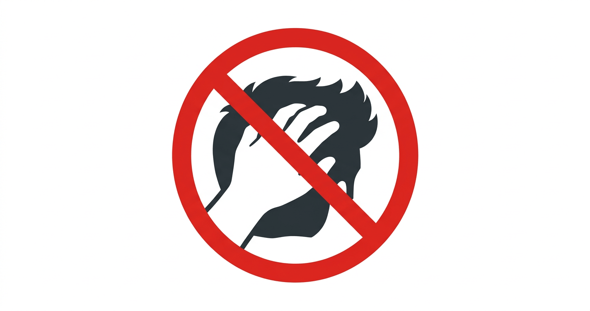

# Hair Guard

A browser-based tool that uses your webcam and [MediaPipe Pose Landmarker](https://ai.google.dev/edge/mediapipe/solutions/vision/pose_landmarker) to detect when your hand gets near your head — and plays an alert sound to help you stop touching your hair.

Everything runs locally in the browser. No data leaves your device.

**Try it live:** [hair-guard.vercel.app](https://hair-guard.vercel.app/)

## How it works

1. Click **Start** to grant camera access
2. The app loads a pose detection model (GPU-accelerated) and tracks your wrists and temples in real time
3. When a wrist gets too close to your head, a warning flashes and an alert sound plays
4. After a short cooldown, it resets and keeps watching

## Development

```bash
./serve.sh  # starts a local server on :8000 and opens the browser
```

No build step, no bundler, no dependencies to install. Everything loads via CDN ES module imports. Just serve over HTTP (required for ES modules and webcam access).

## Stack

- Vanilla JS, HTML, CSS — single-page app, three files
- [MediaPipe Tasks Vision](https://ai.google.dev/edge/mediapipe/solutions/vision/pose_landmarker) for pose detection
- Deployed on [Vercel](https://vercel.com)
